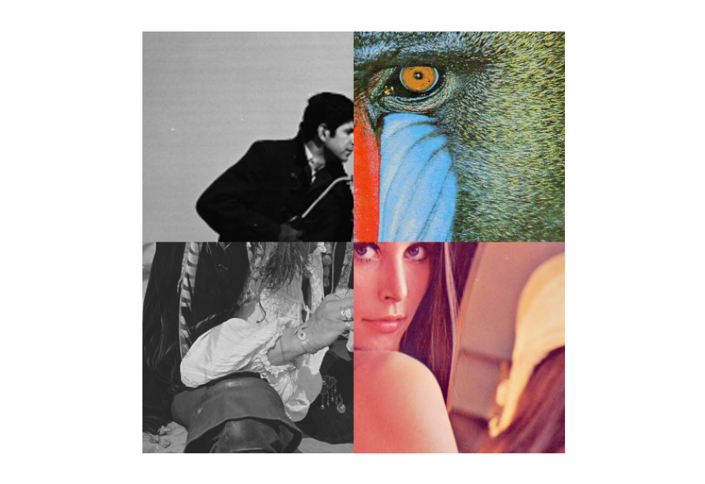
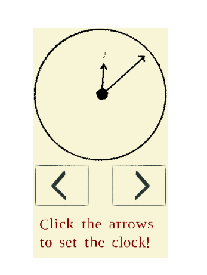

# npGUI

This package implements Graphical User Interfaces from a NumPy user
perspective: every image corresponds to an ndarray.

The main goal of this package is to provide a 
simple way (given certain background and tastes) to build *prototypes* of graphical user interfaces.
In particular, we do not claim for computational performance.

---
## Main features
The core class is
ClickableImage whose instances' attributes are: 


* a dictionary of parameter values,
* a callable that returns an image of fixed shape,
* regions in that shape defined as boolean images of the same shape 
* and their corresponding callbacks.

When calling the use method of an instance,
the dictionary is passed to the callable, that uses (some of) its values
as arguments and outputs an image which is displayed in a window.

Upon clicking on the distinguished regions, their callbacks are called
and alter the parameter values. The image is then refreshed from this 
input.

When closing the window, the use method returns the dictionary with
its altered values; whence the interaction with the user.

These objects can be stacked vertically and horizontally to compose more
complex ones. A certain number of subclasses are proposed as basic 
building blocks. The stacked blocks may have parameter keywords in common,
which allows for interactions between them.

## Installation
This package can be installed with pip as follows.

```
$ pip install np_gui
```

To avoid [depency hell](https://en.wikipedia.org/wiki/Dependency_hell), you might consider installing this package in a virtual environment.

## Documentation

A detailed documentation of this package is available in pdf and html
format within the ./doc/ folder of [its GitHub repository](https://github.com/completementgaga/npGUI).

## Demo

Some demonstration scripts are provided on the [GitHub repository](https://github.com/completementgaga/npGUI).

These are:
* ./demo/puzzles/puzzles.py 
    | Preview of the puzzles.py demo.|
    |:-----------------------------:|
    ||

* ./demo/clock/clock.py

    | Preview of the clock.py demo.|
    |:-----------------------------:|
    ||

## Further developments of the project
This package could benefit from several enhancements, among other things:
 
 * develop additional specialized subclasses of ClickableImage,
 * include keyboard interactions,
 * lighten its memory usage.

Feel free to open the discussion through issues and pull requests on the [GitHub repository](https://github.com/completementgaga/npGUI).

Feedbacks are also welcome by e-mail or by giving the project a star.


